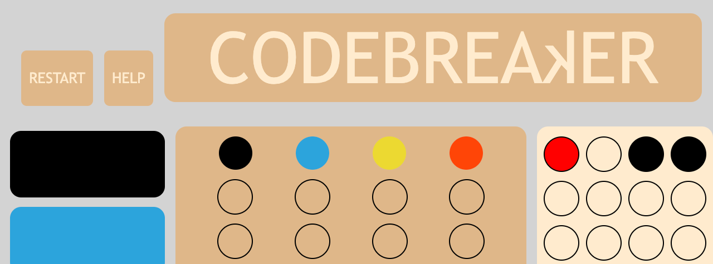

# CodeBreaker
A code cracking logic game based on the classic 1972 board game, Mastermind 
## Object
Match the secret 4-element code in 10 guesses or fewer
## Set Up
-For each game of 10 guesses, a random 4-element code is generated from the 6 possible colors, including duplicates
-For every 4-element guess entered, feedback populates in the 4 circles in the column on the right.
## Feedback Clues

-the red dot in position 1 indicates that **one** of the guess elements is the right color in the right position

-the black dots in position 3 and 4 **each indicate that one** of the guess elements is the right color, but in the wrong position

-the blank feedback dot in position 2 indicates that one of the colors guessed is not included in the secret code at any position

-the position of the feedback dots **DO NOT CORRESPOND DIRECTLY** to the positions of the guess dots, so in the example, the red dot is **not** indicating the black guess specifically, and the black dots are **not** indicating the yellow and red guesses specifically.

## Game Play
Click on color buttons to populate each 4-element guess

When the 4th element is selected, feedback will populate

Interpret the feedback and move on to the next guess

If the guess matches the secret code, the code will be revealed and you have won!

If the 10th guess is not a match for the secret code, the code will be revealed and you have failed.

## Good Luck!

https://francesobrien.github.io/CodeBreaker/

## Installation

### Fork This Repo!

At GitHub, fork this repo and clone it to your workstation. 

In VS Code terminal, enter the following:

git clone https://github.com/francesobrien/CodeBreaker.git

For more guidance on forking and cloning:

[fork-and-clone]https://docs.github.com/en/get-started/quickstart/fork-a-repo#forking-a-repository

## Technology & Languages used
-HTML

-JavaScript

-CSS

-GitHub Pages

## Acknowledgements

Huge appreciations to Per Scholas SWE Cycle 28 for creating a thriving, encouraging environment and a robust cohort for feedback and development, including to Tishana Trainor for presiding over this constantly commenting bunch and holding all of us to high standards and engendering a culture of self-responsibility. 

Special thanks to Kasper Kain for guidance in creating the 2D arrays, pushing me to think about the steps to get my rough idea into reality, and for generally being awesome and helpful.

Thanks also to Richard and Gary for jumping in when I was stuck, and Oriana for the GitHub walk-through.

I'd also like to appreciate mdn docs and w3schools--two great sites that I reference almost constantly.

Shoutout to Chase, whose css class on 10/21 was really clear and thorough.
